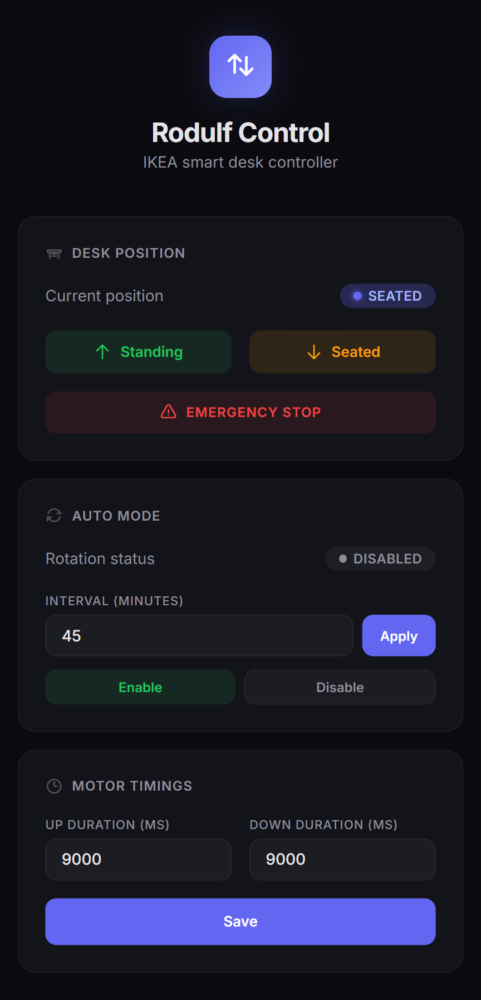
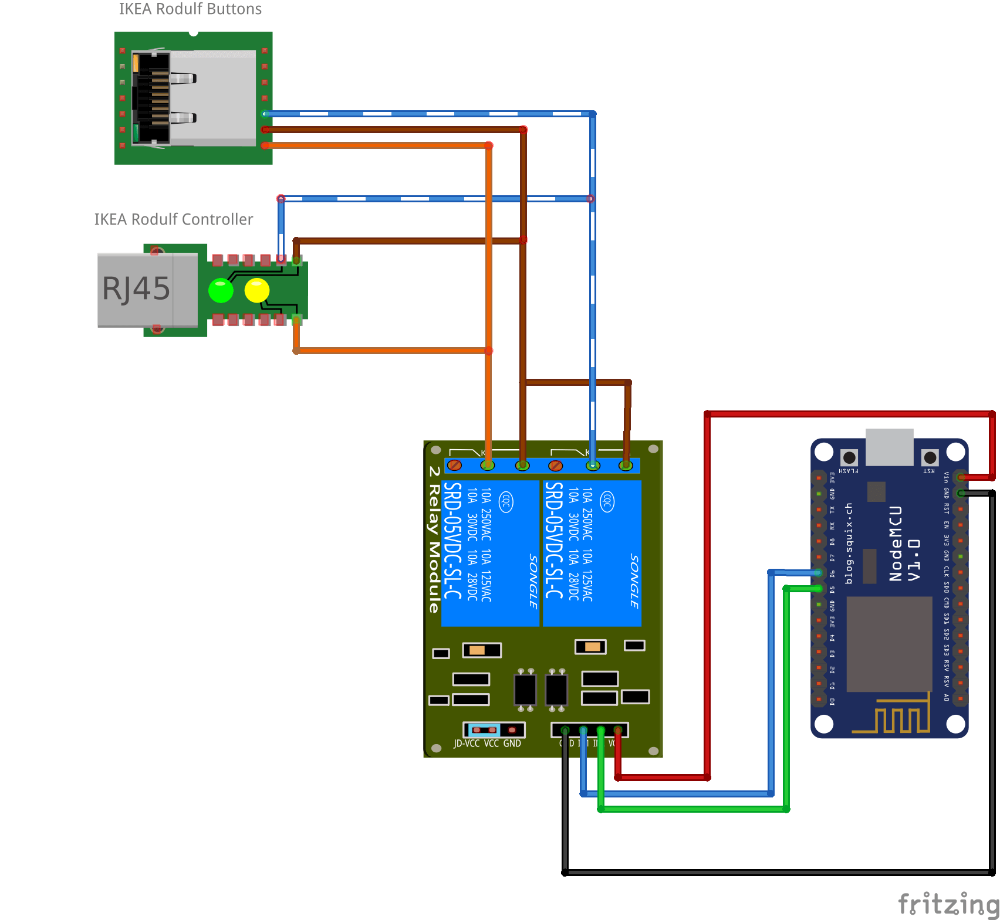

# IKEA RODULF Sit/Stand Desk - WiFi Automation
Turn your manual IKEA RODULF desk into a smart, WiFi-controlled desk using an ESP8266 (NodeMCU) and a 2-channel relay module. Control it from any browser on your local network.



## Table of Contents

- [Features](#features)
- [Hardware Requirements](#hardware-requirements)
- [Wiring & Connections](#wiring--connections)
- [Getting Started](#getting-started)
- [Repository Structure](#repository-structure)
- [Web Interface](#web-interface)
- [API Reference](#api-reference)
- [Limitations](#limitations)
- [Possible Improvements](#possible-improvements)

## Features

- **Remote control**: raise or lower the desk from any device on your WiFi network.
- **Original desk buttons still work**: relays are wired *in parallel* with the built-in buttons, so physical control is never disabled.
- **Auto-rotate mode**: automatically alternates between sitting and standing at a configurable interval (e.g. every 30 min).
- **Configurable motor timings**: set independent durations (ms) for up and down movements.
- **Persistent configuration**: all settings are saved to flash (LittleFS) and survive reboots.
- **Emergency stop**: instantly cuts power to both relays from the web UI.
- **Minimal footprint**: the entire UI is a single minified HTML page served from the ESP8266. No external server or cloud.

## Hardware Requirements

| Component | Qty | Notes |
|---|---|---|
| ESP8266 NodeMCU v1.0 (or compatible) | 1 | Wemos D1 Mini also works |
| 2-Channel 5 V Relay Module | 1 | Active-LOW, opto-isolated recommended |
| 5 V USB power supply | 1 | Powers the NodeMCU via micro-USB |
| IKEA RODULF sit/stand desk | 1 | Manual model with built-in up/down buttons |

## Wiring & Connections



### Relay Module to NodeMCU

| Relay Pin | NodeMCU Pin | Purpose |
|---|---|---|
| VCC | VIN (5 V) | Powers the relay coils |
| GND | GND | Common ground |
| IN1 | D5 | Relay 1 (UP) |
| IN2 | D6 | Relay 2 (DOWN) |

### Relay Module to Desk Buttons (RJ-45 Cable)

The RODULF desk buttons connect to an internal controller board via an **RJ-45 cable**. Only three of the eight wires are relevant:

| RJ-45 Wire Color | Function |
|---|---|
| **Orange** | DOWN signal |
| **Blue/white** | UP signal |
| **Brown** | Common (GND) |

The buttons work by shorting the signal wire to brown (GND). The relays are wired in parallel with these signals:

- **Relay 1 (UP)**: `COM` to brown wire, `NO` to blue/white wire.
- **Relay 2 (DOWN)**: `COM` to brown wire, `NO` to orange wire.

The RJ-45 output from the relay assembly must still be connected to the RODULF controller board so the desk receives the signals. Because the wiring is in parallel, the original physical buttons continue to work normally.

> **Important:** Use the `NO` (Normally Open) terminal on each relay, not `NC`. This keeps the motor off by default.

### Power

- NodeMCU is powered via micro-USB from a 5 V adapter.
- The relay module draws 5 V from the NodeMCU's VIN pin.
- The desk motor uses its own internal power supply; you are only switching button signals, not motor power.

## Getting Started

### 1. Install Arduino IDE & Board Support

1. Install the [Arduino IDE](https://www.arduino.cc/en/software) (v1.8+ or v2.x).
2. In **File > Preferences**, add this URL to **Additional Board Manager URLs**:
   ```
   http://arduino.esp8266.com/stable/package_esp8266com_index.json
   ```
3. In **Tools > Board > Board Manager**, search for `esp8266` and install the package.

### 2. Configure the Sketch

1. Open `ikea_rodulf_automation/ikea_rodulf_automation.ino`.
2. Set your WiFi credentials:
   ```cpp
   const char* ssid = "YourWiFiName";
   const char* password = "YourWiFiPassword";
   ```
3. (Optional) Adjust defaults:
   ```cpp
   // {timeUpMs, timeDownMs, isStanding, autoModeActive, autoIntervalMs}
   DeskConfig myConfig = {9000, 9000, false, false, 1800000};
   ```

### 3. Upload

1. Connect the NodeMCU via USB.
2. Select **Board:** `NodeMCU 1.0 (ESP-12E Module)` and the correct **Port**.
3. Set **Flash Size** to a partition with LittleFS (e.g. `4MB (FS:2MB OTA:~1019KB)`).
4. Click **Upload**.

### 4. Find the IP Address

Open **Serial Monitor** at 115200 baud after upload, or check your router's DHCP client list.

### 5. Open the Control Panel

Navigate to `http://<ESP_IP>/` from any browser on the same network.

### 6. (Optional) Developing the Frontend

```bash
cd frontend
npm install
npm run build     # produces index.min.html
```

Copy the minified output into the `handleRoot()` raw string in the `.ino` file.

## Repository Structure

```
├── README.md
├── sketch.png                         # Wiring diagram image
├── sketch.fzz                         # Fritzing source (editable)
├── fritzing_parts/                    # Custom Fritzing components
│   ├── 2-Channel 5v Relay Shield-fixed.fzpz
│   └── NodeMCUV1.0.fzpz
├── ikea_rodulf_automation/
│   └── ikea_rodulf_automation.ino     # Arduino sketch (ESP8266)
└── frontend/
    ├── index.html                     # Readable web UI source
    ├── index.min.html                 # Minified build (embedded in .ino)
    ├── package.json                   # npm build script
    └── package-lock.json
```

## Web Interface

Single HTML page with embedded CSS/JS. No frameworks or external dependencies at runtime.

- **Desk Position**: current state badge (Standing/Seated/Offline), buttons for up, down, and emergency stop.
- **Auto Mode**: enable/disable toggle and interval setting (minutes).
- **Motor Timings**: configure up/down relay duration (ms) and save to flash.
- **Auto-refresh**: polls `/status` every 3 seconds.

## API Reference

All endpoints use `GET` for simplicity.

| Endpoint | Parameters | Description |
|---|---|---|
| `/` | | Control panel (HTML) |
| `/status` | | JSON with current state |
| `/standing` | | Move desk up |
| `/seated` | | Move desk down |
| `/stop` | | Emergency stop |
| `/auto` | `enable=1\|0`, `interval=<min>` | Configure auto-rotate |
| `/config/set` | `up=<ms>`, `down=<ms>` | Set motor durations |

**Example `/status` response:**

```json
{
  "heightState": "standing",
  "autoMode": true,
  "intervalMinutes": 30,
  "timeUpMs": 9000,
  "timeDownMs": 9000,
  "isMoving": false
}
```

## Limitations

- **No position sensor**: the system tracks direction only, not actual height. Using the physical buttons will desync the reported state.
- **Timing calibration required**: you must measure your desk's actual travel time and enter it manually.
- **DHCP only**: the IP may change if your router reassigns it.
- **No authentication or HTTPS**: anyone on the same network can control the desk.

## Possible Improvements

- **mDNS**: reach the desk at `http://rodulf.local/` via `ESP8266mDNS`.
- **OTA updates**: flash new firmware over WiFi with `ArduinoOTA`.
- **Height sensor**: add HC-SR04 or VL53L0X for real position feedback.
- **Authentication**: basic HTTP auth or API key.
- **MQTT / Home Assistant**: publish state and accept commands over MQTT.
- **Button state detection**: read physical button signals on ESP8266 inputs to keep state in sync.
- **WebSocket updates**: replace polling with push for instant UI refresh.
